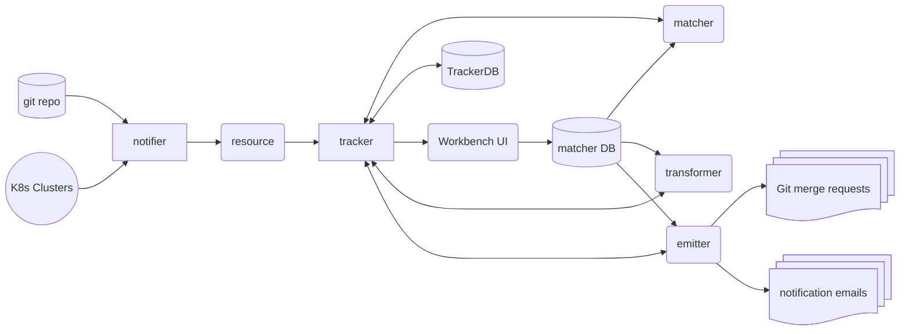

# Resource Morpher (resmorph) Design Dokument

## Purpose

resmorph is intendended to support DevOps engineers in maintaining resource definitions for desired state configuration through changes of API versions and applying regulatory and compliance policies.

## Components of the system

This shows data flow, not control flow

### Notifier

The notifier collects resources from their place of origin (e.g. storage in a Git repo or active resource in a kubernetes cluster) and reports it to the tracker.

### Tracker

The tracker maintains a list of resources, that are reported by any of the notifiers. It will also track the state of change and whether a match was made an if a transformation was performed.

### Matcher

The matcher tries to match the resources managed by the tracker database against the schema rules and mappings maintained by the matcher DB. A mapping is a rule for mapping a resources against a certain schema or other identifying feature. A specific transformer may be assigned to a mapping, in order to transform the existing resource into a new form by the transformer.

If a transformation is assigned to a mapping by the matcher, the tracker will schedule a transformation by the transformer.

### Matcher DB

The ruleset for the matcher and the transformer.

### Transformer

Apply a transformation to a given resource, returning the new resource to the tracker.

### Emitter

write new resources to the appropriate place and in the right format, as defined by the 

## Data Model

## Notes

* A `k8s-secrets-notifier` must filter the actual secret from the data sent to the matcher
* The `tracker` and/or `matcher` should cache found resources, so that the same resource from the same origin will only be handled once. But the metadata of a resources must include the location where it was found at.